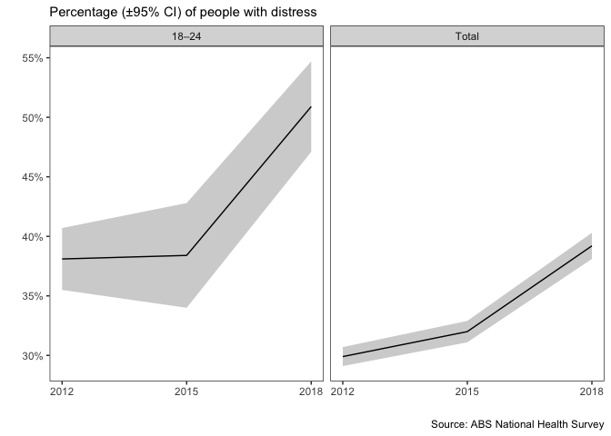
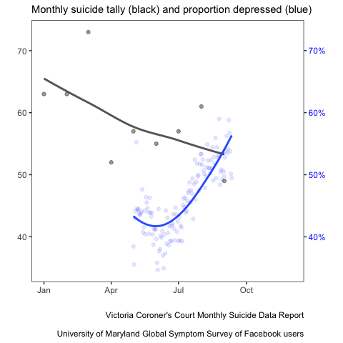

Enough rope
================

Do suicide rates in Australia vary with population-level estimates of
mental health?  
(Date rendered: 2020-10-23)

Licensed under
[CC-BY-SA-4.0](https://creativecommons.org/licenses/by-sa/4.0/)

## Background

###### Impact of social and economic events on suicide rate

The highest annual age-standardised rate for males in the last century
occurred in 1930 (29.8 deaths per 100,000 population), during the Great
Depression—a period of high unemployment, particularly among males. The
rise in both male and female suicide rates in the 1960s has been
attributed, in part, to the unrestricted availability of barbiturate
sedatives (Oliver & Hetzel 1972; Whitlock 1975). Subsequent falls in
these rates in the late 1960s and early 1970s have in turn been
attributed to the introduction of restrictions to the availability of
these drugs in July 1967 (AIHW: Harrison & Henley 2014). High rates of
suicide in the late 1980s and early 1990s coincide with a period of
economic uncertainty in Australia.
(<https://www.aihw.gov.au/suicide-self-harm-monitoring/data/deaths-by-suicide-in-australia/suicide-deaths-over-time>)

###### Recent trends in suicide rates

Since 2012, the overall suicide rate has increased from 11.2 (10.8-11.7
95% CI) to 12.1 (11.6-12.5 95% CI), a difference of almost 1 percent
however the 95% bounds provided by the ABS overlap, indicating any
increase may be insubstantial. The suicide rate for young people (aged
18-24) has increased from 5.9 deaths per 100,000 population to 7.6 in
2018, a difference of 1.7 percent (for which no confidence intervals are
provided).

<!-- -->

 

Overall, an increase in suicide over this period is hard to detect.
Among total suicides, where as many as 3,046 were recorded in 2018, no
statistically significant increase is apparent. Some increase is
apparent in the 18-24 age group, however the numbers in this subgroup
represent approximately a tenth of the total in 2018 (*n* = 358), making
inference more difficult.

  

###### Recent trends in psychological distress

A widely-used indication of the mental health and wellbeing of a
population is the Kessler Psychological Distress Scale
[(K10)](https://www.amhocn.org/sites/default/files/publication_files/kessler_10_manual.pdf).
The K10 questionnaire was developed to yield a global measure of
psychosocial distress, based on questions about people’s level of
nervousness, agitation, psychological fatigue and depression in the past
four weeks.

The ABS estimates the psychological distress levels for the Australian
population from the *National Health Survey*. The ABS reports
representative estimates of the population with “low”, “moderate”,
“high” or “very high” levels of psychological distress. Here we
describe the proportion of people reporting some level of distress
(i.e., greater than “low”) by calculating the complement of the
proportion reporting “low” levels of distress (*P*distressed
= 1 — *P*low). This has the benefit of using the largest
proportion with the smallest associated error.

In 2012 (the first year for which data is readily available online), the
proportion of distressed people, i.e., those reporting some level of
distress greater than “low”, was estimated at 29.9 (±0.8) percent, but
this increased to 39.2 (±1.1) percent by 2018, a difference of over 9
percent and well outside the 95% confidence limits. The proportion of
distressed young people has also increased from 38.1 (±2.6) percent in
2012 to 50.9 (±3.8) percent in 2018, a difference of 12.8 percent which
is also well outside the 95% confidence limits.

 

<!-- -->

 

Thus distress levels have increased rapidly in Australia in recent
years, in young people as well as across the population as a whole.

## COVID-19 and the Victorian shut-down

Victoria reduced its cases to as few as 3 new cases a day (7-day
trailing average) in early June, however a second wave forced the State
government to shut borders and reintroduce lockdown restrictions across
the State capital Melbourne and surrounding regions in early July (July
7th). A state of disaster was declared on August 2nd with increased
restrictions for at least six weeks.

 

###### Facebook psychological distress data

In partnership with University of Maryland (and Carnegie Mellon
University), global Facebook users were invited to take off-platform
surveys to self-report COVID-19-related symptoms, and the data were made
available as part of the [The COVID-19 Symptom Data
Challenge](https://www.symptomchallenge.org). Every day, a new
representative sample of Facebook users over 18 years old was invited to
consent and participate. Sampled users received the invitation at the
top of their News Feed and the surveys were conducted off the Facebook
app by the academic partner. Participants reported on COVID-19 symptoms,
social distancing behavior, financial constraints, and psychological
distress. (<https://ojs.ub.uni-konstanz.de/srm/article/view/7761>)

Indicators for nervousness, depression, and anxiety, adapted from the
K10 scale (Kessler et al. 2003), were collected as part of the survey.
The survey data is provided in granular but aggregate form (i.e., no
response-level or person-specific data). Facebook provided
regionally-specific weights to reduce nonresponse and coverage bias in
age and gender. The total number of responses in the sample used here
(Victoria, Australia) was *N* = 70,607.

 

###### Victorian Suicide Data

The suicide data was provided by the [Coroner’s
report](https://www.coronerscourt.vic.gov.au/sites/default/files/2020-10/Coroners%20Court%20Suicide%20Data%20Report%20-%20Report%202%20-%2005102020.pdf)
on monthly suicide data in Victoria.

 

#### Suicide and psychological distress in Victoria in 2020

Suicide in Victoria did not change with the proportion of people
reporting depression in 2020. The monthly tally of suicides in Victoria
shows a slighlty declining trend over the time period, from *n* = 63 in
January to *n* = 49 in September. By contrast, the proportion of people
reporting depression increased from 43.2 percent in May to 53.6 percent
in September (blue), an increase of over ten percent.

<!-- -->

 

Thus the estimated proportion of reported depression in Victoria
increased, while we did not observe concomitant increases in the
incidence of suicide. Instead, suicide tended to diverge from depression
over the same period.

#### Conclusions

The dissonance between the decline in mental health and the incidence of
suicide, particularly notable for a lack in young people where massive
rises have been predicted, has several possible, and not necessarily
mutually exclusive, explanations and inferences:

1.  Suicide rates are a poor indicator of the community’s mental health,
    an inference supported by the observation that rising rates of
    mental distress in young people in Australia over the past few years
    have not been matched by increases in the suicide rate
2.  Suicides result from a complex interplay with many very proximal
    factors including access and substance use. Counterintuitively the
    lockdown in Victoria may have reduced access to these and we may see
    a post lockdown increase in the suicide rate
3.  The huge uncertainty in predicting rare events has not been
    reflected in the modelling, some of which assumes a change in mental
    health as the mediating pathway, and results in high predictions.
    The total excess suicide deaths across 53 countries (accounting for
    78 percent of Europe’s population, and 88 percent of the population
    in the Americas - nearly a billion people) was 4884 (95% confidence
    interval 3907 to 5860) in the year after the GFC. Predictions of a
    median excess number of suicides of c.1500 per year in Australia
    with a population of just 24 million seems comparatively excessive
    but only time will tell.
